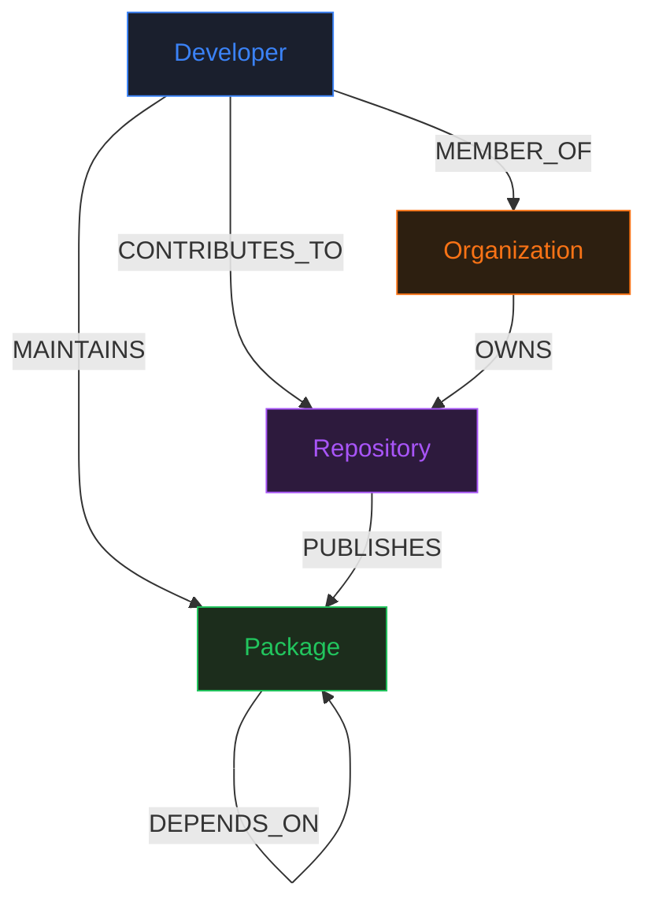

# DepGraph — OSS Supply-Chain Trust Graph

A graph-powered tool for exploring software supply-chain risk: transitive dependencies, bus-factor maintainers, and compromise blast-radius — all modeled as a labeled property graph in CognoDB (Neo4j).

---

## Why a Graph Database?

Three query patterns justify the graph choice:

**1. Transitive dependency closure** is a recursive set operation.  
SQL requires a recursive CTE (`WITH RECURSIVE`) that must be re-written per depth level, has no native path semantics, and becomes painful to optimize. In Cypher:

```cypher
MATCH (p:Package {name: $name})-[:DEPENDS_ON*1..5]->(dep:Package)
RETURN DISTINCT dep.name, dep.ecosystem
```

One line. No recursion boilerplate. Depth is a parameter.

**2. Bus-factor / blast-radius queries** require finding shared neighbors across variable-length paths — e.g., "all packages reachable from packages this developer maintains, and all developers who share maintainership of any package in that set." In SQL, this is a join explosion (N self-joins on a junction table, or a correlated subquery per depth). In Cypher, it's a single pattern match with a `*0..5` range.

**3. The interesting output is the *shape* of connections**, not aggregates over rows. Which package is a single point of failure? Which developer's compromise would cascade to 30 downstream packages? These are structural questions — they're what graph databases were built for.

---

## Data Model



### Node Properties

| Label | Properties |
|-------|-----------|
| `Package` | `id`, `name`, `ecosystem` (npm/pypi), `version`, `description` |
| `Developer` | `id`, `username`, `name`, `github_url` |
| `Repository` | `id`, `name`, `url`, `stars`, `description` |
| `Organization` | `id`, `name` |

### Relationship Properties

| Relationship | Properties |
|-------------|-----------|
| `DEPENDS_ON` | `version_range`, `dev_only` |
| `CONTRIBUTES_TO` | `commits` |
| All others | (none) |

---

## Queries

### Query 1 — Transitive Dependency Closure

**Plain English:** Given a package name, find every package it depends on, directly or transitively, up to 5 hops away.

**Why it's graph-natural:** Recursive closure over a relationship type. In SQL: a `WITH RECURSIVE` CTE with no shortest-path semantics and manual depth management. In Cypher: one line.

```cypher
MATCH (p:Package {name: $name})-[:DEPENDS_ON*1..5]->(dep:Package)
RETURN DISTINCT dep.name AS name,
               dep.ecosystem AS ecosystem,
               dep.version AS version,
               length(r) AS depth
```

---

### Query 2 — Bus Factor Analysis

**Plain English:** Find all packages maintained by exactly one developer, ranked by how many other repositories transitively depend on them. These are your highest-risk single points of failure.

**Why it's graph-natural:** Requires (a) filtering by in-degree of a specific relationship type, (b) then doing a reverse variable-length traversal to count indirect dependents. In SQL: two correlated subqueries + a recursive join. In Cypher: a single pattern with list comprehension + variable-length `*1..5`.

```cypher
MATCH (p:Package)
WITH p, [(dev:Developer)-[:MAINTAINS]->(p) | dev] AS maintainers
WHERE size(maintainers) = 1
OPTIONAL MATCH (repo:Repository)-[:PUBLISHES]->(src:Package)-[:DEPENDS_ON*1..5]->(p)
RETURN p.name, maintainers[0].username AS soloMaintainer,
       count(DISTINCT repo) AS dependentRepoCount
ORDER BY dependentRepoCount DESC
```

---

### Query 3 — Blast Radius

**Plain English:** Given a developer's username, find: (1) all packages reachable from their directly-maintained packages via any DEPENDS_ON chain, and (2) all other developers who share maintainership of any package in that set. This maps the full compromise surface if this account is taken over.

**Why it's graph-natural:** Cross-entity pattern matching across two relationship types at variable depth. A join explosion in a relational schema.

```cypher
// Part A: reachable packages
MATCH (dev:Developer {username: $username})
      -[:MAINTAINS]->(p:Package)-[:DEPENDS_ON*0..5]->(dep:Package)
RETURN DISTINCT dep.id, dep.name, dep.ecosystem, dep.version

// Part B: co-maintainers
MATCH (dev:Developer {username: $username})-[:MAINTAINS]->(p:Package)
      <-[:MAINTAINS]-(other:Developer)
WHERE other.username <> $username
RETURN DISTINCT other.username, collect(DISTINCT p.name) AS sharedPackages
```

---

### Query 4 — Shortest Dependency Path

**Plain English:** Find the shortest DEPENDS_ON chain between two packages. Demonstrates why SQL JOIN chains can't answer "what is the minimum path connecting A to B" — they can enumerate all paths (join explosion) but not find the shortest without application-level BFS.

```cypher
MATCH (a:Package {name: $from}), (b:Package {name: $to})
MATCH path = shortestPath((a)-[:DEPENDS_ON*..10]->(b))
RETURN [n IN nodes(path) | {id: n.id, name: n.name}] AS pathNodes,
       length(path) AS pathLength
```

---

### Query 5 — Top Packages by Transitive Dependent Count

**Plain English:** Rank packages by how many *other* packages depend on them transitively (at depth 1–5). Combined with maintainer count — the intersection of "many dependents" and "one maintainer" is your supply chain's most dangerous packages.

```cypher
MATCH (dep:Package)
OPTIONAL MATCH (src:Package)-[:DEPENDS_ON*1..5]->(dep)
WITH dep, count(DISTINCT src) AS transitiveDepCount
OPTIONAL MATCH (dev:Developer)-[:MAINTAINS]->(dep)
RETURN dep.name, dep.ecosystem, transitiveDepCount,
       count(DISTINCT dev) AS maintainerCount
ORDER BY transitiveDepCount DESC
LIMIT 25
```

---

## Engineered Demo Cases

The seed data includes deliberately hand-crafted scenarios for dramatic query results:

| Developer | Bus-Factor Packages | Why it's dramatic |
|-----------|--------------------|--------------------|
| `ghost-maintainer` | lodash, chalk, left-pad, commander, yargs, underscore | 6 major npm packages, each used by dozens of other packages |
| `pypi-overlord` | requests, urllib3, certifi, chardet, idna | The entire Python HTTP stack — compromise exposes every Python project that makes HTTP calls |
| `fullstack-solo` | express, body-parser, cors, dotenv, @acme/auth-core | Core Express.js middleware stack |

**5-hop dependency chain (for Query 1 demo):**
```
wexa-core → @acme/auth-core → @acme/crypto-utils → @acme/logger → neo-cache → supply-validator
```
Search `wexa-core` in Dep Explorer to see this chain.

---

## Setup

### Prerequisites
- Node.js 18+
- A CognoDB (or Neo4j) instance (bolt+s:// or bolt://)

### 1. Clone & configure

```bash
git clone <repo>
cd congodb

# Backend
cp backend/.env.example backend/.env
# Edit COGNODB_URI, COGNODB_USER, COGNODB_PASSWORD

# Frontend
cp frontend/.env.example frontend/.env
# Edit VITE_API_URL if backend is not on localhost:3001
```

### 2. Seed the database

```bash
cd scripts
npm install
# Copy .env from backend or create a separate .env here
cp ../backend/.env .env
node seed.js
```

Expected output:
```
✅ Seed complete!
   Packages:   45
   Developers: 50
   ...
```

### 3. Run the backend

```bash
cd backend
npm install
npm run dev
# → Listening on http://localhost:3001
```

Verify health: `curl http://localhost:3001/api/health`

### 4. Run the frontend

```bash
cd frontend
npm install
npm run dev
# → http://localhost:5173
```

### 5. Test graceful DB degradation

Set `COGNODB_URI=bolt://invalid-host:9999` in `backend/.env`, restart the backend, and reload the frontend. You should see the "Database Unavailable" state on every page — no stack traces.

---

## Project Structure

```
congodb/
├── backend/
│   ├── src/
│   │   ├── db.js              # Single Neo4j driver, graceful degradation
│   │   ├── index.js           # Express server
│   │   └── routes/
│   │       ├── packages.js    # Package list/search/detail
│   │       ├── developers.js  # Developer list/search/detail
│   │       └── queries.js     # All 5 Cypher queries as endpoints
│   ├── .env.example
│   └── package.json
├── frontend/
│   ├── src/
│   │   ├── components/        # GraphView, SearchPanel, NodeDetail, badges, states
│   │   ├── pages/             # Home, PackageExplorer, BusFactor, BlastRadius
│   │   ├── hooks/             # useDbStatus, useGraph
│   │   ├── lib/api.js         # Typed API client
│   │   └── App.jsx
│   ├── .env.example
│   └── package.json
├── scripts/
│   └── seed.js                # Idempotent MERGE-based seed
├── .gitignore
└── README.md
```

---

## Engineering Notes

- **No string-concatenated Cypher** anywhere — every query uses `session.run(query, params)` with a separate params object.
- **Connection details from env vars only** — `COGNODB_URI`, `COGNODB_USER`, `COGNODB_PASSWORD`. Real `.env` is gitignored.
- **Graceful degradation** — `db.js` catches connection failures and sets `connectionStatus = 'error'`; every API endpoint returns `{ error: 'Database unavailable' }` instead of crashing; the frontend renders explicit error states.
- **Idempotent seed** — 100% `MERGE` statements; safe to run multiple times without duplicating data.

---

## Tech Stack

| Layer | Technology |
|-------|-----------|
| Graph DB | CognoDB (Neo4j) |
| Backend | Node.js + Express + `neo4j-driver` |
| Frontend | React + Vite + Tailwind CSS |
| Graph viz | `react-force-graph-2d` (WebGL canvas) |
| Routing | `react-router-dom` |
| Fonts | IBM Plex Sans + JetBrains Mono |

---

## Hosted Demo

- **Frontend:** [Deploy to Vercel](https://vercel.com) — `vercel --prod` from `/frontend`
- **Backend:** [Deploy to Render](https://render.com) — set env vars in dashboard, deploy from `/backend`

> Keep the CognoDB instance running post-submission.
