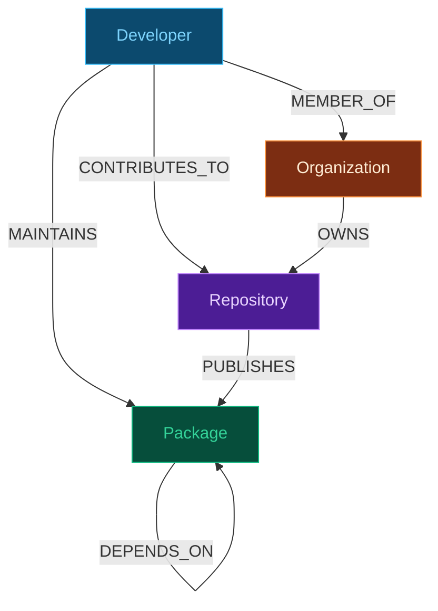

# DepGraph — Open Source Supply-Chain Trust & Risk Graph

[](https://frontend-ten-rose-81.vercel.app)
[](https://github.com/kumarswamyg2005/DepGraph)
[](https://cognodb.com)

**DepGraph** is a graph-powered security dashboard I designed and built to uncover open-source software supply chain vulnerabilities: multi-hop transitive dependency closures, single-maintainer "Bus Factor" risks, and account compromise blast-radius analysis — all powered by **CognoDB (Neo4j)** and **Cypher**.

---

## 🌐 Live Production Demos

- **Live Frontend (Vercel):** [https://frontend-ten-rose-81.vercel.app](https://frontend-ten-rose-81.vercel.app)
- **Live Backend API (Vercel Serverless):** [https://backend-psi-ivory-26.vercel.app/api/health](https://backend-psi-ivory-26.vercel.app/api/health)
- **GitHub Repository:** [https://github.com/kumarswamyg2005/DepGraph.git](https://github.com/kumarswamyg2005/DepGraph.git)

---

## 🧠 Why I Chose a Graph Database Over SQL

When analyzing software supply chain risk, traditional relational databases hit performance walls. Here are the three primary query patterns that justified choosing a graph database:

### 1. Transitive Dependency Closure (Recursive Sets)
In SQL, querying deep dependency trees requires complex `WITH RECURSIVE` CTEs with manual depth bounds that cause join explosions. In Cypher, multi-hop traversal is a single, clean pattern:

```cypher
MATCH (p:Package {name: $name})-[:DEPENDS_ON*1..5]->(dep:Package)
RETURN DISTINCT dep.name, dep.ecosystem, dep.version
```

### 2. Bus Factor & Compromise Blast Radius
Finding shared maintainers and affected packages across variable-length dependency chains requires traversing multi-entity paths (`Developer → MAINTAINS → Package → DEPENDS_ON*0..5 → Package`). In Cypher, this is a single pattern match instead of N self-joins.

### 3. Structural Connectivity as First-Class Output
Supply chain security questions are inherent structural graph questions: *Which single-maintainer package forms a bottleneck for 30 downstream applications?* *Which developer account compromise will cascade across ecosystems?* Graph databases represent these connection shapes natively.

---

## 📐 Data Model & Graph Schema



### Node Properties

| Node Label | Core Properties |
|------------|-----------------|
| `Package` | `id`, `name`, `ecosystem` (npm / pypi), `version`, `description` |
| `Developer` | `id`, `username`, `name`, `github_url` |
| `Repository` | `id`, `name`, `url`, `stars`, `description` |
| `Organization` | `id`, `name` |

### Relationship Types

| Relationship | Key Properties | Description |
|--------------|----------------|-------------|
| `DEPENDS_ON` | `version_range`, `dev_only` | Package-to-Package dependency relationship |
| `MAINTAINS` | — | Developer-to-Package maintainership |
| `CONTRIBUTES_TO` | `commits` | Developer-to-Repository contributions |
| `PUBLISHES` | — | Repository-to-Package publication |
| `MEMBER_OF` | — | Developer organization membership |

---

## ⚡ Core Security Cypher Queries

### 1. Transitive Dependency Closure (`*1..5`)
Computes every direct and indirect dependency for a target package up to 5 hops deep:

```cypher
MATCH (p:Package {name: $name})-[:DEPENDS_ON*1..5]->(dep:Package)
RETURN DISTINCT dep.name AS name,
               dep.ecosystem AS ecosystem,
               dep.version AS version
```

### 2. Bus Factor Risk Analysis
Identifies packages maintained by exactly **one developer**, ranked by how many repositories depend on them transitively:

```cypher
MATCH (p:Package)
WITH p, [(dev:Developer)-[:MAINTAINS]->(p) | dev] AS maintainers
WHERE size(maintainers) = 1
OPTIONAL MATCH (repo:Repository)-[:PUBLISHES]->(src:Package)-[:DEPENDS_ON*1..5]->(p)
RETURN p.name AS packageName, maintainers[0].username AS soloMaintainer,
       count(DISTINCT repo) AS dependentRepoCount
ORDER BY dependentRepoCount DESC
```

### 3. Developer Compromise Blast Radius
Maps the full cascading impact if a developer account is hijacked — finding all reachable packages and co-maintainers:

```cypher
// Part A: Reachable packages
MATCH (dev:Developer {username: $username})-[:MAINTAINS]->(p:Package)-[:DEPENDS_ON*0..5]->(dep:Package)
RETURN DISTINCT dep.id, dep.name, dep.ecosystem, dep.version

// Part B: Co-maintainers
MATCH (dev:Developer {username: $username})-[:MAINTAINS]->(p:Package)<-[:MAINTAINS]-(other:Developer)
WHERE other.username <> $username
RETURN DISTINCT other.username, collect(DISTINCT p.name) AS sharedPackages
```

### 4. Shortest Dependency Path
Calculates the shortest chain of dependencies between any two packages:

```cypher
MATCH (a:Package {name: $from}), (b:Package {name: $to})
MATCH path = shortestPath((a)-[:DEPENDS_ON*..10]->(b))
RETURN [n IN nodes(path) | {id: n.id, name: n.name}] AS pathNodes, length(path) AS pathLength
```

---

## 🛠️ Tech Stack & Key Design Features

- **Frontend:** React 18, Vite, Tailwind CSS, `react-router-dom`
- **Visualization Engine:** `react-force-graph-2d` (WebGL canvas, directional particle flows, hover focus mode, auto camera centering)
- **Backend:** Node.js, Express, official `neo4j-driver`
- **Database:** CognoDB / Neo4j Cloud Instance
- **UI Aesthetics:** Custom Security Operations Center (SOC) dark theme with obsidian backgrounds (`#07090e`), glassmorphism panels, and typography powered by **Plus Jakarta Sans** and **JetBrains Mono**.

---

## 🏃 Local Development & Setup Guide

### Prerequisites
- Node.js 18+
- A CognoDB (or Neo4j) instance URI (`bolt+s://` or `bolt://`)

### 1. Clone & Configure
```bash
git clone https://github.com/kumarswamyg2005/DepGraph.git
cd DepGraph
```

### 2. Set Environment Variables

**Backend (`backend/.env`):**
```env
PORT=3001
COGNODB_URI=bolt+s://db-a44a7657.databases.cognodb.com:7687
COGNODB_USER=cognodb
COGNODB_PASSWORD=your_password_here
```

**Frontend (`frontend/.env`):**
```env
VITE_API_URL=http://localhost:3001
```

### 3. Seed Database
```bash
cd scripts
npm install
node seed.js
```

### 4. Start Development Servers

**Start Backend:**
```bash
cd backend
npm install
npm run dev
# Running on http://localhost:3001
```

**Start Frontend:**
```bash
cd frontend
npm install
npm run dev
# Running on http://localhost:5173
```

---

## ☁️ Deployment Guide

### Deploying Frontend to Vercel
1. Import repository on [Vercel](https://vercel.com).
2. Set Root Directory: `frontend`
3. Environment Variable: `VITE_API_URL` = `https://backend-psi-ivory-26.vercel.app` (or your Render URL).
4. Build command: `npm run build`, Output Directory: `dist`.

### Deploying Backend to Render
1. Create a **Web Service** on [Render.com](https://render.com) connecting the repo.
2. Root Directory: `backend`
3. Build Command: `npm install`, Start Command: `npm start`.
4. Add `COGNODB_URI`, `COGNODB_USER`, `COGNODB_PASSWORD` environment variables.

---

## 👤 Author

Developed by **Kumaraswamy**  
- **GitHub:** [@kumarswamyg2005](https://github.com/kumarswamyg2005)  
- **Repository:** [DepGraph](https://github.com/kumarswamyg2005/DepGraph)
