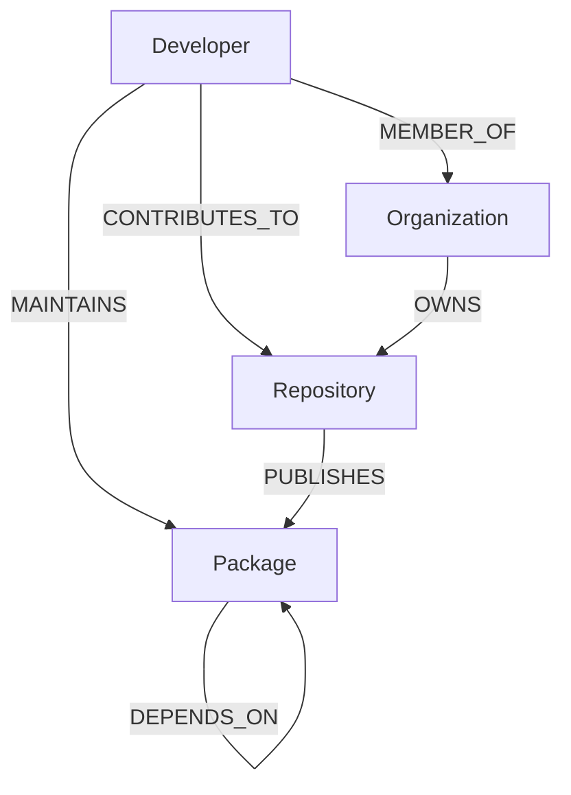

# DepGraph — Open Source Supply-Chain Trust & Risk Graph

DepGraph is an interactive security analysis dashboard for open-source software supply chain risk. It models software packages, developer maintainership, dependencies, and organizational structures as a labeled property graph in CognoDB (Neo4j).

- **Live Application:** [https://dep-graph-five.vercel.app/](https://dep-graph-five.vercel.app/)
- **API Endpoint:** [https://depgraph-ebn8.onrender.com/api/health](https://depgraph-ebn8.onrender.com/api/health)
- **GitHub Repository:** [https://github.com/kumarswamyg2005/DepGraph.git](https://github.com/kumarswamyg2005/DepGraph.git)
- **CognoDB Instance ID:** `db-a44a7657`

---

## Use Case & Graph Rationale

Modern applications rely on deep trees of open-source packages across `npm` and `PyPI`. Evaluating transitive risk, single-maintainer vulnerabilities ("Bus Factor"), and compromise blast-radius presents major performance challenges in relational databases:

1. **Multi-Hop Transitive Dependency Closures**: In SQL, querying N-level transitive dependencies requires complex `WITH RECURSIVE` common table expressions that suffer from join explosions and lack native path semantics. In Cypher, it is a single pattern match:
   ```cypher
   MATCH (p:Package {name: $name})-[:DEPENDS_ON*1..5]->(dep:Package)
   RETURN DISTINCT dep.name, dep.ecosystem, dep.version
   ```

2. **Bus Factor & Blast Radius Analysis**: Finding shared maintainers and affected packages across variable-length dependency chains requires traversing multi-entity paths (`Developer → MAINTAINS → Package → DEPENDS_ON*0..5 → Package`). In Cypher, this is a single query rather than multiple correlated subqueries.

3. **Structural Graph Topology**: Questions regarding single points of failure and cascading vulnerability surfaces are structural graph problems best answered by a graph engine.

---

## Data Model & Schema



### Nodes

| Label | Properties |
|-------|-----------|
| `Package` | `id`, `name`, `ecosystem`, `version`, `description` |
| `Developer` | `id`, `username`, `name`, `github_url` |
| `Repository` | `id`, `name`, `url`, `stars`, `description` |
| `Organization` | `id`, `name` |

### Relationships

| Relationship | Properties | Description |
|--------------|-----------|-------------|
| `DEPENDS_ON` | `version_range`, `dev_only` | Package dependency link |
| `MAINTAINS` | — | Developer package maintainership |
| `CONTRIBUTES_TO` | `commits` | Developer repository contributions |
| `PUBLISHES` | — | Repository package publication |
| `MEMBER_OF` | — | Developer organization membership |

---

## Security Queries

### 1. Transitive Dependency Closure (`*1..5`)
```cypher
MATCH (p:Package {name: $name})-[:DEPENDS_ON*1..5]->(dep:Package)
RETURN DISTINCT dep.name AS name,
               dep.ecosystem AS ecosystem,
               dep.version AS version
```

### 2. Bus Factor Risk Analysis
```cypher
MATCH (p:Package)
WITH p, [(dev:Developer)-[:MAINTAINS]->(p) | dev] AS maintainers
WHERE size(maintainers) = 1
OPTIONAL MATCH (repo:Repository)-[:PUBLISHES]->(src:Package)-[:DEPENDS_ON*1..5]->(p)
RETURN p.name AS packageName, maintainers[0].username AS soloMaintainer,
       count(DISTINCT repo) AS dependentRepoCount
ORDER BY dependentRepoCount DESC
```

### 3. Developer Compromise Blast Radius
```cypher
// Part A: Reachable packages
MATCH (dev:Developer {username: $username})-[:MAINTAINS]->(p:Package)-[:DEPENDS_ON*0..5]->(dep:Package)
RETURN DISTINCT dep.id, dep.name, dep.ecosystem, dep.version

// Part B: Co-maintainers
MATCH (dev:Developer {username: $username})-[:MAINTAINS]->(p:Package)<-[:MAINTAINS]-(other:Developer)
WHERE other.username <> $username
RETURN DISTINCT other.username, collect(DISTINCT p.name) AS sharedPackages
```

### 4. Shortest Dependency Path
```cypher
MATCH (a:Package {name: $from}), (b:Package {name: $to})
MATCH path = shortestPath((a)-[:DEPENDS_ON*..10]->(b))
RETURN [n IN nodes(path) | {id: n.id, name: n.name}] AS pathNodes, length(path) AS pathLength
```

---

## Tech Stack

- **Frontend:** React 18, Vite, Tailwind CSS, `react-force-graph-2d`
- **Backend:** Node.js, Express, `neo4j-driver`
- **Database:** CognoDB (Neo4j)

---

## Local Setup

### 1. Environment Variables

Create `backend/.env`:
```env
PORT=3001
COGNODB_URI=bolt+s://db-a44a7657.databases.cognodb.com:7687
COGNODB_USER=cognodb
COGNODB_PASSWORD=your_password
```

Create `frontend/.env`:
```env
VITE_API_URL=http://localhost:3001
```

### 2. Seed Database
```bash
cd scripts
npm install
node seed.js
```

### 3. Run Application

Backend:
```bash
cd backend
npm install
npm run dev
```

Frontend:
```bash
cd frontend
npm install
npm run dev
```

---

## Author

**Kumaraswamy**  
GitHub: [@kumarswamyg2005](https://github.com/kumarswamyg2005)
